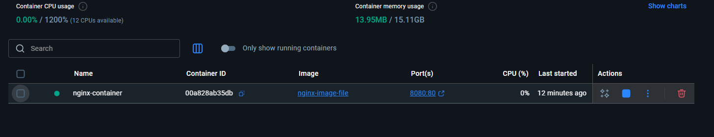

# Лабораторная работа №2

# Версия Докера

# Создание Nginx image и container

В Docker Desktop был установлен базовый image-файл для Nginx:

Установив нужный нам image-файл, в папке проекта мы создаем два файла - index.html и Dockerfile:

index.html - для перезаписи главной страницы, которая инициализируется при создании Nginx контейнера
Dockerfile - файл образа(image) контейнера, нужен для инициализации контейнера

Находясь в одной директории с Dockerfile, мы запускаем команду "docker build" и получаем следю результат:

В Docker Desktop мы должны увидеть созданный нами файл образа:

Создав файл образа, можно создать наш Docker контейнер при помощи команды "docker run" с параметрами, и получаем след. результат:

docker run -d -p 8080:80 --name nginx-container nginx-image-file

1f96a31872de760488c0877aafb4e8667bb45f8c79b139e9663b98372b33b38f

-d - Запуск в фоновом режиме

-p 8080:80 - Связываем порт 8080 на хосте с портом 80 внутри контейнера Nginx

--name nginx-container - Имя контейнера

nginx-image-file - Указываем, какой образ мы хотим использовать создания контейнера

Вот скриншоты доказательства работы Nginx контейнера:

